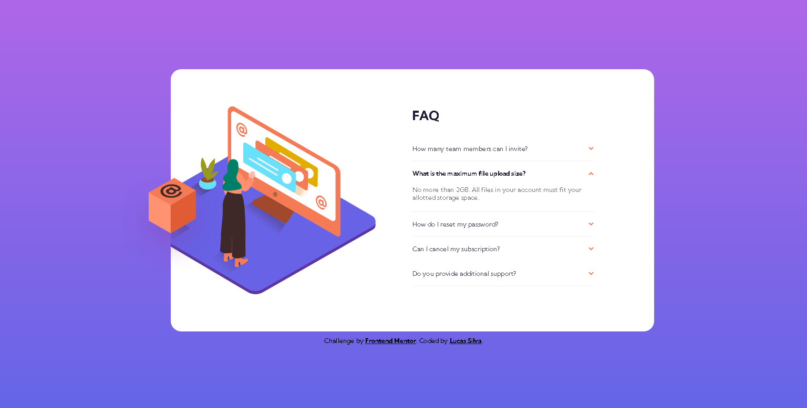

# Frontend Mentor - FAQ accordion card solution

## Table of contents

- [Overview](#overview)
  - [The challenge](#the-challenge)
  - [Screenshot](#screenshot)
  - [Links](#links)
- [My process](#my-process)
  - [Built with](#built-with)
- [Author](#author)

## Overview

In this challange, i had to build a FAQ accordion card using HTML, CSS and Javascript.

### The challenge

Users should be able to:

- View the optimal layout for the component depending on their device's screen size
- See hover states for all interactive elements on the page
- Hide/Show the answer to a question when the question is clicked

### Screenshot

### Links

- Solution URL: [GitHub Repo](https://github.com/lucasfs022/FAQ-Accordion)
- Live Site URL: [GitHub live site](https://lucasfs022.github.io/FAQ-Accordion/)

## My process

### Built with

- Semantic HTML5 markup
- CSS custom properties
- Flexbox
- Javascript

## Author

- Website - [Lucas Silva](https://www.lfsdev.com.br)
- Frontend Mentor - [@lucasfs022](https://www.frontendmentor.io/profile/lucasfs022)
- Linkedin - [Lucas Silva](linkedin.com/in/lucas-silva-658980161)

